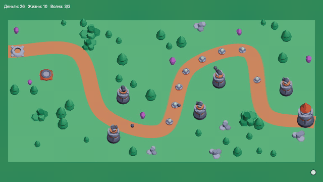

# td3d — 3D tower defense на React Three Fiber

Волны врагов идут по пути к базе, игрок строит башни в слотах, башни сами стреляют.
Победа — пережить три волны, поражение — потерять все жизни.

**Играть: https://td3d-ochre.vercel.app**



[Запись партии целиком, 53 секунды (mp4)](https://github.com/msilkov/td3d/releases/download/v0.1.0/td3d-gameplay.mp4)


## Как играть

- **Старт** запускает первую волну.
- Клик по пустому слоту строит башню за 50 монет. Наведение на слот показывает радиус.
- За каждого убитого врага — монеты, за каждого дошедшего до базы — минус жизнь.
- Старт: 100 монет и 10 жизней. Без башен партия проигрывается, разумная застройка выигрывает.

## Стек

Vite, React 19, TypeScript, three.js, @react-three/fiber, @react-three/drei, zustand, Vitest, oxlint.

Покадровое состояние (позиции врагов, снаряды) живёт в `useRef` и меняется в `useFrame`.
В zustand — только то, что видит интерфейс: деньги, жизни, волна, башни.
Анимации процедурные: покачивание врагов, поворот пушек, облёт камеры при победе, красный свет при поражении.

## Запуск

```sh
npm install
npm run dev     # dev-сервер
npm test        # тесты логики: стор, выбор цели, волны
npm run build   # проверка типов и сборка
```

Прод выкатывается вручную — workflow `Deploy` в GitHub Actions.

## Документация

- [docs/SPEC.md](docs/SPEC.md) — спецификация MVP, этапы и критерии приёмки
- [GLOSSARY.md](GLOSSARY.md) — словарь терминов
- [docs/adr/](docs/adr/) — архитектурные решения

## Ассеты

Модели — [Kenney Tower Defense Kit](https://kenney.nl/assets/tower-defense-kit), CC0.
